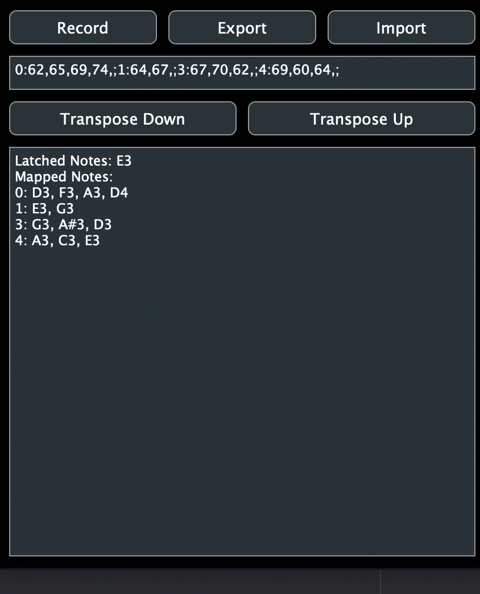

#  Drone Latcher

This project is both a midi latcher (i.e. it holds the notes/chords you played until you play the next chord) and a midi mapper for a pedalboard that sends program change events (e.g. the Behringer FCB1010). This plugin uses [JUCE](juce.com) as a framework, and you will need it to build (you can get it for free with the GPL License).

## Usage as pure midi latcher

To use the plugin as a pure midi latcher, you have to do nothing. Just add the plugin as a midi FX into the signal chain of your favorite DAW and you should be ready to go. 

## Usage with pedalboard

First, note that you need a FCB1010 or a similar pedalboard which can send program change messages via midi. To create the midi mapping, connect both the pedalboard and a normal midi keyboard to the same midi input into the plugin. This can be achieved e.g. with virtual midi devices, which merge midi commands from multiple inputs. Then set the plugin to Recording mode (press the Record button in the UI). Now, play a chord with the midi keyboard. The chord should be latched normally and it should be displayed in the textbox. Now, press the button on the pedalboard to record the mapping between the program change message and the currently active chord. Repeat the procedure for as many chords as you like.
If you want to quickly transfer previous mappings between multiple instances of the plugin, press the "Export" button and a text representation of the internal memory state appears in the textbox. Copy+paste this into the other instance of the plugin and press "Import" on the other plugin, and you have transferred the map. You can also save the map in a textfile for backup purposes, however it should also be saved along with the DAW project.
Once you have finished mapping, put the plugin out of Recording mode and now a press of the pedalboard will create a midi message on channel 0 with 127 velocity and the notes you have mapped. Again, the notes will be latched until you press a different pedal on the board.

# Build

To build this, open the Midilatch.jucer file in Projucer and export to whichever development environment you use. Then build in that development environment. In some builds, the generated .vst3 file is automatically copied to your OS .vst3 directory.

